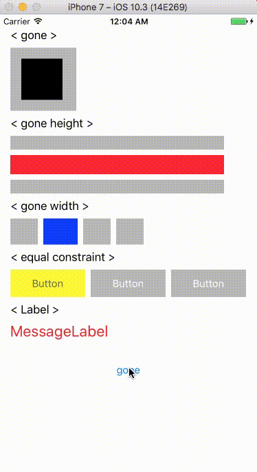

# UIViewGoneVisible

[](https://developer.apple.com/iphone/index.action)
[](https://developer.apple.com/swift)
[](http://mit-license.org)
[](http://twitter.com/yteruto)

GoneVisible is a UIView extension that uses AutoLayout to add "gone" state like Android.



## Requirements ##
* Swift 3.0
* iOS 8.0+
* Xcode 8

## Installation ##
#### Manual ####
Simply drag `UIView+GoneVisible.swift` into your project.

#### Cocoapods ####
- Add into your Podfile.

```:Podfile
pod "GoneVisible"
```

Then `$ pod install`
- Add `import GoneVisible` to the top of your files where you wish to use it.

## Usage ##

・Gone.
```swift
view.gone()
```

・Visible.
```swift
view.visible()
```

・When setting to Gone, set the space constraint constant together to 0.
```swift
view.gone(spaces: [.trailing])
```

・Set either the height or the width of the size constraint to 0.
```swift
view.gone(direction: .height)
```

##### See also:  
- [:link: iOS Example Project](https://github.com/terutoyamasaki/GoneVisible/tree/master/Example/GoneVisibleExample)

## License ##

The MIT License (MIT)

Copyright (c) 2017 Teruto Yamasaki
